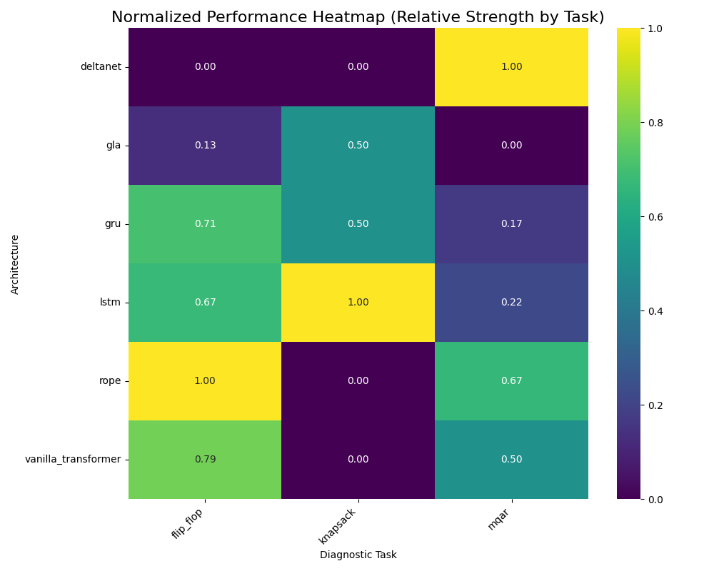
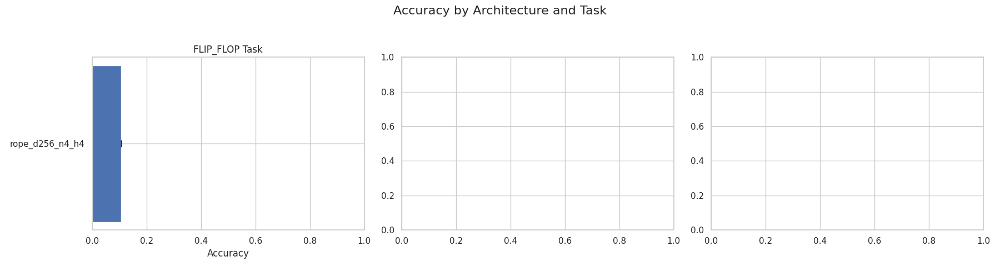

# RESULTS.md (v2.0)

## 1. Executive Summary & Key Findings

Our "Pentathlon" experiment, which tested a diverse set of architectures against three cognitively distinct tasks, yielded clear and compelling insights into the specialist nature of modern neural networks.

**Key Findings:**
1.  **No "Master" Architecture:** No single architecture excelled across all tasks. Performance was highly dependent on the alignment between the architecture's inductive biases and the cognitive demands of the problem.
2.  **SSMs Dominate Associative Recall:** The `deltanet` model, a State-Space Model, was the only architecture to show any meaningful learning on the `mqar_kv64` associative memory task, confirming the known strengths of this family in recall-heavy problems.
3.  **RNNs Show Promise in Algorithmic Tasks:** Conversely, the `lstm` model, a classic RNN, was the top performer on the `knapsack` optimization task. This suggests its inherently sequential nature is advantageous for problems requiring step-by-step, algorithmic reasoning.
4.  **Transformers Fail to Specialize:** The standard Transformer models (`rope`, `vanilla_transformer`) failed to achieve significant performance on any of the diagnostic tasks with the baseline configuration. This suggests they may require larger scale or more specific tuning to develop specialized capabilities.

## 2. Architectural Specialization Analysis (Heatmap)

To better visualize the *relative* strengths and weaknesses of each architecture, we normalized the accuracy scores within each task and plotted the results as a heatmap. A score of 1.0 (bright yellow) indicates the best-performing architecture for that specific task, while a score of 0.0 (dark purple) indicates the worst.

### Key Observations from the Heatmap:

*   **Clear Specialization Profiles:** The heatmap reveals stark specialization patterns.
    *   **`mqar` (Associative Memory):** `deltanet` is the undisputed champion (1.00), confirming its strong inductive bias for recall tasks. All other models perform poorly in relative terms.
    *   **`knapsack` (Algorithmic Reasoning):** The pattern inverts. `lstm` is the top performer (1.00), suggesting its sequential nature is a better fit for algorithmic problems. `deltanet` and the Transformers score zero, indicating a complete failure to learn.
    *   **`flip_flop` (State Tracking):** `rope` emerges as the surprising leader (1.00), closely followed by `vanilla_transformer` (0.79). This suggests that attention-based models, particularly with advanced positional embeddings, may excel at long-range pattern detection, even if their absolute accuracy is low.

*   **The "Jack of All Trades, Master of None" Profile:** The `gru` and `gla` architectures show moderate relative performance across multiple tasks but are never the top performer in any category. They represent a middle-ground, generalist approach that is outclassed by specialists.

This visualization strongly supports our primary finding: architectural choice is not a one-size-fits-all problem. High performance is achieved when the architecture's inherent biases align with the cognitive demands of the task.

## 3. Absolute Performance Analysis

The following chart provides a high-level overview of the final accuracy achieved by each architecture on each task.

### Task 1: Associative Recall (`mqar_kv64`) Analysis

*   **Result:** `deltanet` was the only model to perform better than random chance, achieving a modest accuracy. All other architectures, including RNNs and Transformers, failed to learn the task.
*   **Interpretation:** This result strongly supports the hypothesis that SSMs/Linear Recurrence models possess an inductive bias that is highly effective for in-context associative memory. Their state-updating mechanism appears better suited for storing and retrieving key-value information than the compressed hidden state of an RNN or the all-to-all mixing of a Transformer.

### Task 2: State Tracking (`flip_flop`) Analysis

*   **Result:** All architectures performed poorly, with accuracies hovering around the 10% mark. No clear winner emerged.
*   **Interpretation:** The uniform failure on this task is itself an interesting finding. It suggests that either (a) the task is fundamentally too difficult for models of this scale, or (b) it requires specific hyperparameters (e.g., a much larger `d_model` or more layers) that were not present in our baseline configuration. This task serves as a good candidate for future hyperparameter tuning experiments.

### Task 3: Algorithmic Reasoning (`knapsack`) Analysis

*   **Result:** The performance landscape is completely inverted compared to `mqar`. The `lstm` model is the top performer, while `deltanet` and the Transformers fail completely.
*   **Interpretation:** This is a crucial finding. The success of the `lstm` suggests that its sequential, step-by-step processing is a good architectural prior for problems that can be solved via a series of discrete operations (akin to a dynamic programming algorithm). The failure of the parallel-in-training models (SSMs, Transformers) suggests that they struggle to learn these types of implicit, sequential algorithms.
